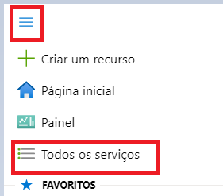
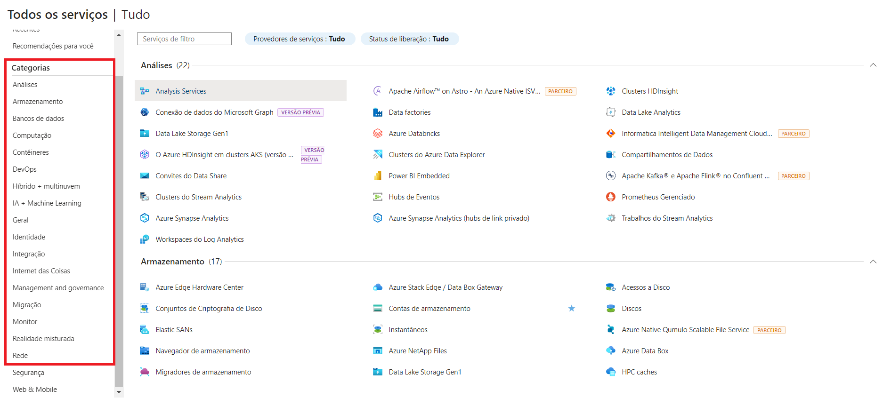

# Localização de Serviços no Microsoft Azure

Este guia contém o resumo das lições aprendidas durante o desenvolvimento do lab na DIO.

## Índice

- Guia oficial da Microsoft: [Introdução](https://azure.microsoft.com/pt-br/get-started/welcome-to-azure)
- [Tutorial de Serviços de Computação e Rede do Azure](https://learn.microsoft.com/pt-br/training/modules/describe-azure-compute-networking-services/).

## Roteiro apresentado no lab:

### Acessando o Portal do Azure

1. Abra seu navegador e acesse [portal.azure.com](https://portal.azure.com).
2. Faça login com suas credenciais da Microsoft.

### Localizando servços por categoria:

Na página inicial são exibidos alguns dos principais serviços disponíveis no portal do Microsoft Azure. Para visualizar todos os serviços separados por categoria, basta selecionar a opção "Mais Serviços":

Outra forma de acessar todos os serviços é utilizando o menu laterial e selecionando a opção "Todos os serviços":

Ao acessar essa opção serão exibidos todos os serviços disponíveis no portal do Microsoft Azure separados por categoria.
Através do menu lateral esquerdo, é possível selecionar a categoria desejada para encontrar um produto específico.

**Observação:** Serviços destacados com a tag "Versão Prévia" estão em fase de testes e podem ser descontinuados a qualquer momento pela Azure, por isso requerem maior cautela com relação ao seu uso.

