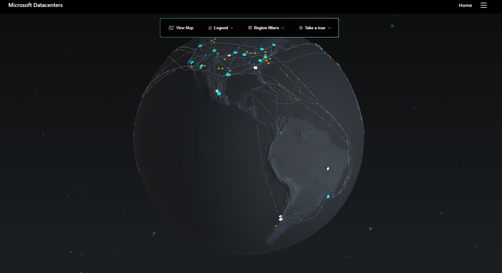

# Criando um Grupo de Recursos no Microsoft Azure

Fonte: [Infraestrutura global do Azure](https://datacenters.microsoft.com/globe/explore/)

## Introdução

- [Azure Resource Manager](https://learn.microsoft.com/pt-br/azure/azure-resource-manager/?WT.mc_id=APC-Resourcegroups).

Este desafio consiste em explorar o portal do Microsoft Azure, fornecendo instruções sobre como criar um Grupo de Recursos.
Um grupo de recursos é um contêiner lógico para recursos implantados no Azure. Esses recursos são tudo o que você criar em uma assinatura do Azure como máquinas virtuais, Gateways de Aplicativo e instâncias do Cosmos DB.

Todos os recursos precisam estar em um grupo, e um recurso pode ser um membro de apenas um grupo de recursos. Muitos recursos podem ser movidos entre grupos de recursos com alguns serviços que têm limitações ou requisitos específicos de movimentação. Os grupos de recursos não podem ser aninhados. Antes de provisionar qualquer recurso, você precisa de um grupo de recursos para colocá-lo.

Grupos de recursos também são um escopo para a aplicação de permissões de RBAC (controle de acesso baseado em função). Ao aplicar permissões de RBAC a um grupo de recursos, você pode reduzir a administração e limitar o acesso para permitir apenas o que é necessário.

## Acessando o Portal do Azure

1. Abra seu navegador e acesse [portal.azure.com](https://portal.azure.com).
2. Faça login com suas credenciais da Microsoft.

## Criando um Grupo de Recursos

1. No menu portal do Azure ou na página Inicial ou na caixa de pesquisa "Pesquisar serviços e o marketplace", procure e selecione Grupo de recursos. O painel Grupo de recursos é exibido. Selecione Criar um recurso para exibir o painel Criar um grupo de recursos.
2. Na guia Básico, preencher a configuração do novo grupo:
    - Assinatura: selecione a assinatura do Azure que deseja utilizar.
    - Grupo de recursos: defina um nome para o grupo de recursos.
    - Região: selecione a região onde o grupo de recursos será criado. 
3. A guia Marcações é opcional, porém possui várias funcionalidades, como por exemplo adicionar um subtítulo para o grupo de recursos para especificar ainda mais a que ele se refere. Esta ação auxilia a identificar para qual centro de custo uma despesa da fatura deverá ser direcionado, por exemplo.
4. Selecione Revisar + Criar e, após a aprovação da validação, clique em Criar para criar o grupo de recursos.

### Explorando um Grupo de Recursos

1. No menu portal do Azure ou na página Inicial, em Serviços do Azure, selecione Grupos de recursos.
2. Na lista, selecione o grupo de recursos recém-criado. O painel Grupo de recursos é exibido
3. Na página Visão geral, você encontrará as informações básicas sobre o grupo de recursos, como a assinatura em que ele reside, a ID da assinatura, as marcas aplicadas e um histórico das implantações feitas nele.
4. Em IAM (Controle de acesso), é possível conceder ou remover o permissionamento de acesso aos usuários.

### Adicionando um recurso

5. Para criar um recurso para teste, por exemplo uma VNET (rede virtual), na barra de menu superior selecione Criar, ou selecione Criar recursos na parte inferior do painel.
6. Na caixa de pesquisa Pesquisar serviços e o marketplace, procure e selecione Rede virtual. O painel Rede virtual é exibido. Selecione Criar para exibir o painel Criar rede virtual.
7. Na guia Básico, preencher a configuração do novo grupo:
    - Assinatura: selecione a assinatura do Azure que deseja utilizar.
    - Grupo de recursos: selecione o grupo de recursos recém-criado.
    - Nome da rede virtual: defina um nome para a rede.
    - Região: selecione uma região - pode ser diferente da região do grupo de recursos.
8. Selecione Revisar + criar e, depois de passar na validação, selecione Criar para adicionar a rede virtual ao seu grupo de recursos.
9. Volte para o grupo de recursos. A rede virtual deverá aparecer no painel Visão geral.

Você poderia criar mais recursos dentro deste grupo de recursos ou criar mais grupos de recursos na assinatura e implantar os recursos nesses grupos de recursos. Ao criar recursos, você geralmente tem a opção de criar um grupo de recursos como uma alternativa a usar um grupo de recursos existente.

